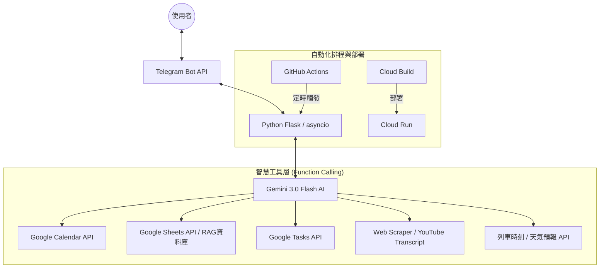

# Gemini 個人智慧秘書與健康教練 (Intelligent Personal Secretary & Health Coach)

本專案是一個基於 Google Gemini 模型的個人數位轉型方案，旨在透過單一 Telegram 介面，整合日程管理、待辦清單、運動科學與中醫養生智慧，解決現代資訊碎片化導致的個人管理負擔。

## 核心價值
透過 AI 代理人 (Agent) 自動化繁瑣的日常紀錄與查詢工作，將零散的 Google 服務（日曆、試算表、待辦事項）轉化為具備「上下文感知」的智慧助理，提供主動式的健康建議與生活規劃。

## 系統架構 (Solution Architecture)

本系統採去中心化整合架構，核心邏輯由 Gemini 進行決策，並透過 Function Calling 驅動外部工具與 Google 生態系。

### 1. 數據與控制流



### 2. 資料流說明
- **對話輸入**：使用者發送文字或網址至 Telegram。
- **決策分析**：Gemini 根據系統指令與對話上下文，判定是否需要呼叫特定工具。
- **工具執行**：Python 後端執行對應 API 請求（如：新增日曆、記錄運動、爬取網頁、查詢天氣）。
- **智慧回覆**：Gemini 彙整結果，以專業且具備溫度的口吻回饋使用者。

## 技術棧 (Tech Stack)
- **核心語言**：Python 3.10+ (asyncio, Flask)
- **人工智慧**：Google Gemini API (Function Calling)
- **通訊介面**：Telegram Bot API
- **雲端整合**：Google Workspace API (Calendar, Sheets, Tasks)
- **部署環境**：Docker, Google Cloud Run, GitHub Actions

## 關鍵功能 (Key Features)
- **主動健康管理**：結合中醫節氣與個人體質，自動安排運動菜單並記錄 RPE 訓練強度。
- **智慧任務管理**：透過文字快速新增待辦事項至指定 Google Tasks 清單。
- **精準天氣預報**：提供 24 小時精簡預報及一週冷熱趨勢視覺化圖表。
- **知識自動沉澱**：自動抓取網頁或 YouTube 字幕內容，產出摘要並收藏至個人 Inbox。
- **即時交通查詢**：整合台鐵動態，一鍵查詢火車誤點與時刻資訊。
- **自動例行資訊**：依據個人習慣提供定時的高度整合資訊，極大化科技資訊效率

## 部署指南 (Deployment)

### 1. 環境設定 (Environmentail Variables)

請在專案根目錄建立 `.env` 檔案，並配置以下變數：

```env
TELEGRAM_BOT_TOKEN=your_telegram_token
GEMINI_API_KEY=your_gemini_api_key
SPREADSHEET_ID=your_google_sheet_id        
CWA_API_KEY=your_weather_api_key
WEBHOOK_URL=your_deployment_url
```

### 2. 本機運行 (Local Development)

*   **一般執行**：
    ```bash
    # 啟動 Polling 模式 (適合開發除錯)
    python main.py --mode polling
    ```

*   **Docker 本機部署**：
    ```bash
    docker build -t gemini-bot .
    docker run -p 8080:8080 --env-file .env gemini-bot
    ```

### 2. GCP 雲端部署 (Production - Cloud Run)

本專案已配置 `cloudbuild.yaml`，支援透過 Google Cloud Build 自動化部署至 Cloud Run。

*   **手動觸發部署**：
    ```bash
    gcloud builds submit --config cloudbuild.yaml .
    ```

## 專案結構 (Project Structure)
```text
.
├── main.py              # 程式進入點 (Telegram 與 Flask 路由)
├── services/
│   ├── gemini_ai.py     # Gemini 模型初始化與 Function 綁定
│   └── google_api.py    # Google API 授權與 Service Factory
├── tools/
│   ├── calendar_mgr.py  # Google 日曆管理
│   ├── todo_list.py     # Google Tasks 待辦清單管理
│   ├── health.py        # 健康數據與 Sheets 紀錄
│   ├── weather.py       # 中央氣象署 API 整合 (視覺化圖表)
│   ├── scraper.py       # 網頁摘要與 YouTube 字幕抓取
│   ├── transport.py     # 台鐵即時動態查詢
│   └── common.py        # 共享輔助函式與基礎工具
├── Dockerfile           # 容器化定義
└── cloudbuild.yaml      # GCP 自動化部署設定
```

---
*本專案僅供作品集展示使用。*